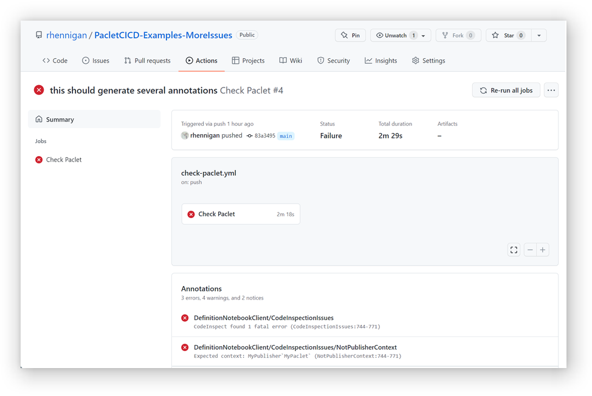
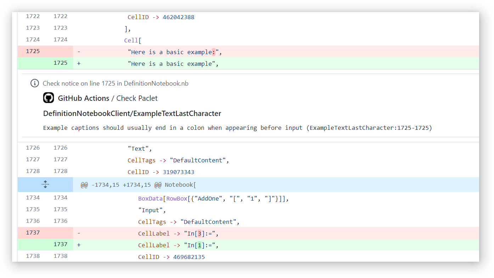
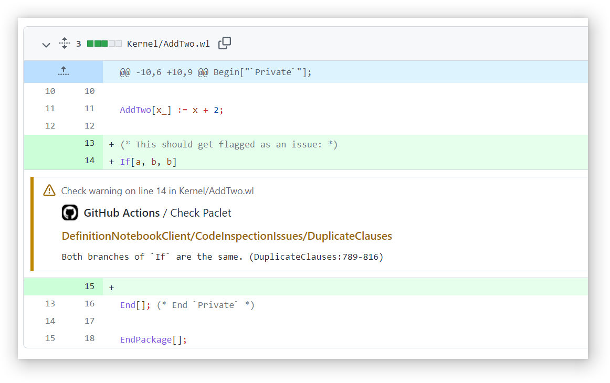
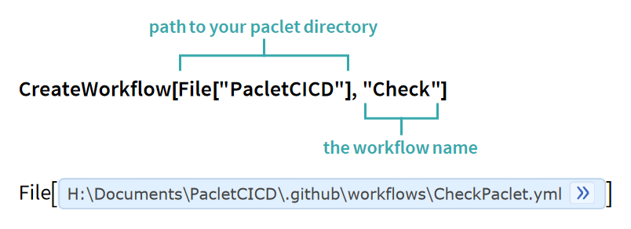

********************************************************************************

[](https://github.com/rhennigan/PacletCICD/actions/workflows/check-paclet.yml) [](https://github.com/rhennigan/PacletCICD/actions/workflows/release.yml)

[](https://wolfr.am/11IbYlNIW)

# Installing PacletCICD


## From the [Wolfram Paclet Repository](#ComingSoon)

Using Wolfram Language version 13.0 or later:

```Mathematica
PacletInstall[ResourceObject["Wolfram/PacletCICD"]]
```

## Using [GitHubInstall](https://resources.wolframcloud.com/FunctionRepository/resources/GitHubInstall/)

Using Wolfram Language version 12.0 or later:

```Mathematica
ResourceFunction["GitHubInstall"]["rhennigan", "PacletCICD"]
```

## From Github
The PacletCICD release comes in the form of a `.paclet` file, which contains the entire package and its documentation. Download the latest release from the [GitHub repo's releases page](https://github.com/rhennigan/PacletCICD/releases). To install, run the following command in the Wolfram Language:

```Mathematica
PacletInstall["/full/path/to/PacletCICD.paclet"]
```

This will permanently install the PacletCICD paclet. The Wolfram Language will always use the latest installed version of PacletCICD. Installed versions can be enumerated using the command:

```Mathematica
PacletFind["Wolfram/PacletCICD"]
```

And all versions can be uninstalled using the command:

```Mathematica
PacletUninstall["Wolfram/PacletCICD"]
```

# Features

Automatically check Paclets for potential issues in a GitHub CI/CD workflow:



Generate code annotations automatically whenever code is pushed to a branch:






## GitHub Actions

PacletCICD functions can be used indirectly via the following GitHub Marketplace actions:
* [build-paclet](https://github.com/marketplace/actions/build-paclet)
* [check-paclet](https://github.com/marketplace/actions/check-paclet)

These actions can also be automatically configured for your Paclet by using WorkflowExport:



# License

This project is licensed under the terms of the MIT license. See the LICENSE file in the root directory of this source tree for details.
